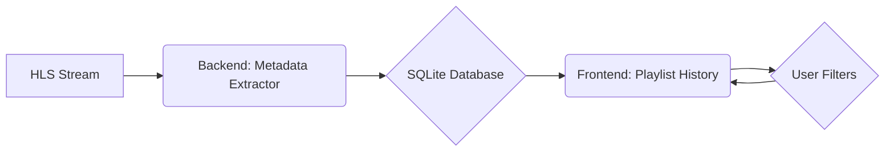

# Product Requirements Document: Web-Based Application for m3u8 Audio Stream Metadata

## 1. Introduction

This document outlines the requirements for a web-based application that interfaces with an m3u8 audio stream endpoint, containing a series of fMP4 audio chunks. The application will extract metadata from the audio stream, store it in a database, and provide a user-facing component to view playlist history with real-time filtering.

## 2. Goals

*   Extract artist, title, and album metadata information from the audio stream.
*   Store the metadata in a simple database, along with a timestamp.
*   Provide users with the ability to view playlist history.
*   Implement real-time filtering of the playlist fields without additional requests to the service.
*   Mirror the style of an existing website (https://www.savvybeastradio.com).

## 3. Detailed Plan

### 3.1. Backend (Metadata Extractor)

*   **Language:** Python
*   **Functionality:**
    *   Fetch the m3u8 playlist from the specified URL.
    *   Download the latest audio segments (fMP4).
    *   Extract metadata (artist, title, album) from the audio segments using ID3 tags.
    *   Store the extracted metadata in an SQLite database, along with a timestamp.
*   **Database:** SQLite
    *   **Schema:**
        *   `id`: INTEGER PRIMARY KEY AUTOINCREMENT
        *   `artist`: TEXT
        *   `title`: TEXT
        *   `album`: TEXT
        *   `timestamp`: DATETIME
*   **Implementation:**
    *   Modify [`direct_stream_metadata.py`](direct_stream_metadata.py) to:
        *   Accept the m3u8 playlist URL as a command-line argument or environment variable.
        *   Connect to the SQLite database.
        *   Store the extracted metadata in the database.
        *   Run continuously, extracting metadata and storing it in the database.

### 3.2. Frontend (Playlist History)

*   **Language:** HTML, CSS, JavaScript
*   **Framework/Library:** None (to match the style of the provided website)
*   **Functionality:**
    *   Display the playlist history from the SQLite database.
    *   Implement real-time filtering by artist, title, and album.
    *   Mirror the style of [https://www.savvybeastradio.com](https://www.savvybeastradio.com).
*   **Implementation:**
    *   Create an HTML page to display the playlist history.
    *   Use CSS to style the page to match the Savvy Beast Radio website.
    *   Use JavaScript to:
        *   Fetch the playlist history from the backend.
        *   Display the playlist history in a table or list.
        *   Implement real-time filtering using JavaScript.
*   **API Endpoint:**
    *   Create a simple API endpoint on the backend (e.g., using Flask or FastAPI) to serve the playlist history from the SQLite database.

### 3.3. Filtering Implementation

*   The frontend will use JavaScript to filter the playlist history in real-time.
*   The user will be able to enter text in the artist, title, and album fields.
*   As the user types, the JavaScript code will filter the playlist history to show only the songs that match the entered text.
*   The filtering will be case-insensitive.

### 3.4. Deployment

*   The backend can be deployed to a server or cloud platform.
*   The frontend can be hosted on a web server or CDN.

## 4. Technologies

*   Python
*   SQLite
*   HTML
*   CSS
*   JavaScript